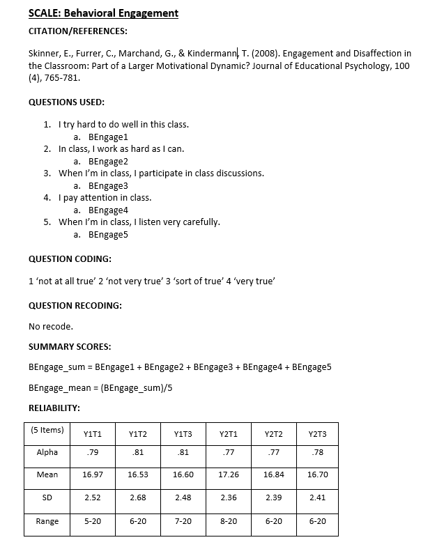
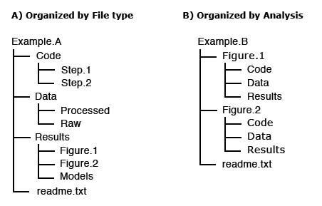

```{r setup, include=FALSE}
options(htmltools.dir.version = FALSE)

library(tidyverse)
library(kableExtra)
```


# So you were just awarded a grant.......

--

```{r fig.align="center", echo=FALSE}

```


---

# About this training series


IES has a policy on providing access to your data at the conclusion of projects funded through their research centers. Specifically:

  * Exploration grants  
  * Initial Efficacy and Follow-Up grants


The plan for sharing data must be laid out in a data management plan (DMP) which is included as an appendix in your grant application.


This training series is not how to write a DMP, but how to successfully **implement** one!

```{r, echo=FALSE, fig.align="center", out.width='70%'}


```


---

# Research life cycle

```{r, echo=FALSE, fig.align="center", out.width='60%'}


```

Source: [Center for Open Science](https://www.cos.io/) and [Jessica Logan, Ph.D](https://figshare.com/articles/Data_Management_and_Data_Management_Plans/7890827)

---

# Replication crisis


```{r out.width='70%', fig.align="center", echo=FALSE}
knitr::include_graphics("img/reproducibility-graphic-online1.jpeg")
```

Source: [Nature](https://www.nature.com/news/1-500-scientists-lift-the-lid-on-reproducibility-1.19970#/b1)

---

# Solution: Implement good DMPs

* Type of data to be shared

* Procedures for managing and maintaining confidentiality

* Roles and responsibilities of project staff in the management of research data  

* Expected schedule for data sharing  

* Format of the final dataset 

* **<span style="color: #D35400; ">Documentation to be provided</span>** 

* Method of data sharing  

* Explanation of possible data sharing agreement  

* Any circumstances that prevent any data from being shared  

* A plan for pre-registering your study

Source: [IES](https://ies.ed.gov/funding/datasharing_implementation.asp) and [IES](https://ies.ed.gov/funding/pdf/2021_84305A.pdf)

---

# A data file with no documentation

What questions do you have?

```{r, echo=FALSE, fig.align="center", out.width='70%'}

ID <-c(seq(5,25,5))
cohort <- c(1,1,2,2,2)
treatment <- c(0,0,1,1,0)
fall_toca1 <- c(1,2,3,3,4)
fall_toca2 <- c(1,2,3,4,5)
spring_toca1v1 <- c(1,3,NA,4,4)
spring_toca2 <- c(1,3,5,5,5)

df <- data.frame(ID, cohort, treatment, fall_toca1, fall_toca2, spring_toca1v1, spring_toca2)

df %>%
  kable("html") %>%
  kable_styling("striped", full_width=T)

```

--

What was the intervention?

--

Who are the subjects? How were they chosen?

--

How was this data collected? Survey?

--

What years were data collected?

---

# Questions

```{r, echo=FALSE, fig.align="center"}

df %>%
  kable("html") %>%
  kable_styling("striped", full_width=T)

```

<br>
--

How are the variables coded? What is 0 vs 1?

--

What is the question text for toca1?

--

Why is there a different version of toca1 in the spring?

--

Were there any manipulations done on this data?

---

# Solution: Documentation!

<br>

```{r fig.align="center", echo=FALSE}

```


---

# Why document?

<br>

--
* Track decisions/changes made throughout the life cycle of the project

--

* Make our decisions/analyses replicable   

--

* Clean our data with fidelity  

--

* Ensure others use and interpret our data accurately

--

* Discover errors in our data  

--

* Allows others to find our archived data through metadata

---

# What is documentation?

IES states documentation "should be a comprehensive and stand-alone document that includes all the information necessary to replicate the analysis performed by the original research team" and should include:

--

* a summary of the purpose of the data collection  

--

* methodology and procedures used to collect the data  

--

* timing of the data collection  

--

* details of the data codes, definition of variables, variable field locations, and frequencies 

<br>
<br>
<br>
<br>

Source: [IES](https://ies.ed.gov/funding/datasharing_implementation.asp)

---

# Types of documentation

1. **Protocol**

1. **Style Guide**

1. **Wiki**

1. **Data dictionary**

1. **Codebook**

1. **README**

1. **Metadata**

1. **Miscellaneous**

---

# Protocol

A document/s to record all your procedures as well as changes made to those procedures throughout the grant.

Should cover procedures/decisions for the following:

--

* Participant recruitment 

--

* Consent and assent

--

* Participant selection

--

* Randomization and blinding/unblinding

--

* Data collection

--

* Staff training

--

* Data entry, data retrieval, data scoring

--

* Payments/Incentives

--

* Intervention implementation

---

# Protocol

Each protocol should *begin* with:

* Title
* Date the protocol was made   
* Who made the protocol  
* Any rationale behind the protocol  
* Any related documents or research behind this protocol  

**Then write up the details about the procedure/protocol.**

--

For any *changes* to the protocol after the project has begun add the following below the original protocol   section:  
 * Revision date  
 * Who decided on the revision  
 * Any rationale behind the revision  
 * Any related documents or research behind the revision 
---

# Example protocol


Source: [Jessica Logan, Ph.D.](https://figshare.com/articles/Data_Management_and_Data_Management_Plans/7890827)

---

# Style Guide

* A set of standards around data management rules

* It improves consistency within and across files and projects

* Style Guide should provide guidance for:
  + variable naming
  + value coding
  + file naming
  + versioning rules
  + file structure

* Can be kept in any file format (.txt, .pdf, .md, etc.)
  
* You may have one style guide that applies to all projects (file structure, versioning rules, file naming), housed centrally on a wiki or as a README in a team folder

* And one guide that applies specifically to each project (variable naming conventions, value coding), kept as a protocol or a README in a project folder


Source: [Wikipedia](https://en.wikipedia.org/wiki/Style_guide)

---

# Example Style Guide

```{r, echo=FALSE, fig.align="center", out.width='90%'}


```

Source: [Bart van de Biezen](https://github.com/bartvandebiezen/file-name-conventions/blob/master/README.md)

---

# Wiki

*A site that is designed for groups of people to quickly capture and share ideas by creating simple pages and linking them together.*

* Think Wikipedia: anyone on your team can add/edit content and then can link to referenced documents for easy access


* Easily built in tools such as Microsoft SharePoint and Teams


* You can make wikis specific to a project and house frequently used information (ex: Recruitment Information, style guide)

* Or a general research team wiki that houses 
  + Frequently requested information (ex: meeting notes or employee manual)
  + Information that is relevant across research projects (ex: style guide)

<br>


Source: [SharePoint](https://support.microsoft.com/en-us/office/create-and-edit-a-wiki-dc64f9c2-d1a2-44b5-ac59-b9d535551a32) and [Education Data Chat](https://www.buzzsprout.com/1074286/5185513-episode-5-organizing-shared-network-drives-tips-and-tricks)

---

# Example wiki

```{r, echo=FALSE, fig.align="center", out.width='80%'}


```

<br>

Source: [Sharepoint](https://support.microsoft.com/en-us/office/create-and-edit-a-wiki-dc64f9c2-d1a2-44b5-ac59-b9d535551a32) and [Slite](https://slite.com/blog/post/how-to-build-a-company-wiki-that-doesnt-suck)

---

# Data dictionary

--
* Captures all relevant variable level information

--

* Should be started *before* data collection begins and *updated throughout* the study

--

* Usually kept in tabular format and each variable has its own row (ex: spreadsheet form)

--

Should capture information such as:

--

* Variable name  
* Variable label as well as exact question text
* Associated scale (if item belongs to a scale)
* Value range or value codes ([1-99] or 0=No, 1=Yes) 
* Measurement unit (Ex: numeric, string, date)  
* Missing data codes 
* Variable universe (who gets this question, is it skipped for some people)  
* What time periods/years does this variable exist  
* Notes (such as versions/changes to this variable)  
* Calculations (composite variables, scores)
* Group variables by measure (teacher survey, teacher interview, etc.)

---

# Data dictionary

To *start* a data dictionary, you should gather the following information:

--

* What measures are we collecting? 

--

* What are the items/scales included?

--

* What is your variable naming protocol?

--

* Do your measures have value coding rules or can we assign our own?

--

* Also consider variables we are assigning/calculating:
  + IDs
  + Time variables (cohort, year, time)
  + Composite scores

---

# Example data dictionary

<br>
<br>
<br>


---

# Codebook

Similar to data dictionary, captures variable as well as some project level information (Title, PIs, purpose)

  * A document to summarize the final datasets as opposed to ongoing documentation
  * Usually in .txt, .pdf, or .xml format
  * Several statistical programs (R, SPSS, SAS and Stata) will export simple codebooks for your final datasets

The main body captures variable level details: 

--

  * Variable name  
  * Variable label  
  * Question text  
  * Coded values (1,2,3,4)  
  * Value labels (Excellent, Good, Fair, Poor)  
  * Summary statistics  
  * Missing data values  
  * Skip patterns  
  * Notes  
  * If data is in text format, indicate position of each variable


---

# Codebook

.pull-left[
Other optional content for a codebook: 

* Citations for scales used

* Data collection instruments 

* Consent agreements

* Computations and/or imputations

* Methodological details  

* Flowchart of data collection instruments/screeners

* Study timeline
]

.pull-right[
```{r, echo=FALSE, fig.align="center"}


```

Source: [IES](https://nces.ed.gov/pubs2015/2015074.pdf)
]

---

# Example codebook

```{r, echo=FALSE, fig.align="center", out.width='90%'}


```

<br>

Source: [NLS](https://www.nlsinfo.org/site/nlsy97/nlsdocs/nlsy97/codesup/maincstoc.html)

---

# Another example codebook

<br>
<br>


<br>
<br>

Source: [Coding2Share](https://coding2share.github.io/ReproducibilityToolkit/Mod4Document.html)

---

# One more example codebook

```{r, echo=FALSE, fig.align="center", out.width='50%'}



```

Source: [MPSI](http://moprevention.org/)

---

# README

.pull-left[
As the name implies, read this first before proceeding
* Plain text file in .txt, .md, .pdf, .xml format
* One README per dataset
* Helps others interpret your data
]

.pull-right[
```{r, echo=FALSE, fig.align="center"}


```
Source: [University of Michigan](https://deepblue.lib.umich.edu/bitstream/handle/2027.42/154114/Personal%20README%20Files-%20User%20Manuals%20for%20Library%20Staff.pdf?sequence=1)
]
<br>

A README can capture the following:  

* General information
* File information
* Sharing/Access information
* Methodology
* Codebook (you can include your .txt codebook in this document for instance)

---

# Example README

<br>
<br>


<br>
<br>
<br>

Source: [Coding2Share](https://coding2share.github.io/ReproducibilityToolkit/Mod4Document.html)

---

# Metadata

* *Data about data*

* Structured data that "provide information about the dataset to help people find, understand, and use your data". 

* The type most commonly referred to as metadata is project-level metadata

--

.pull-left[
1. Project-level

  * Descriptive metadata that aids in the discovery of your data
  * "Label of the dataset"
  * Includes much of the information we discussed including in your READMEs
]

.pull-right[  
```{r, echo=FALSE, fig.align="center"}

knitr::include_graphics("img/metadata.PNG")

```
]


Source: [University of Portland](https://libguides.up.edu/datamanagement/documentation), [University of Helsinki](https://www.helsinki.fi/en/research/guide-for-data-documentation) and [IES](https://ies.ed.gov/funding/datasharing_faq.asp)

---

# Metadata

Can also be categorized further into:

  * Data-level

    + Considered administrative metadata
    + Used to describe the details of your data
    + Includes everything captured in your *Methodology* section in your READMEs 

  * Variable-level

    + Considered structural metadata
    + Can be both incorporated into your data directly (labels)
    + As well as a separate document (your codebook or data dictionary)
  
<br>
<br>

Source: [Oregon State](https://guides.library.oregonstate.edu/research-data-services/data-management-metadata#:~:text=Project%2Dlevel%20metadata%20describes%20the,Dataset%20title) and [North Carolina State](https://www.lib.ncsu.edu/do/data-management/metadata)
  
---
  
# Metadata

* Most notable thing about metadata are standards

* Many fields have metadata standards (a formally agreed upon structure, format, vocabulary, etc.)
  
* Education does **not** currently have metadata standards

  + IES simply states that "researchers should document everything and strive to make notation as interpretable as possible". Metadata can either be embedded within data or included in a separate file such as a README.txt or .pdf file.
  
* However, if you plan to use a data repository, they may have standards in place
    + Consult your repository website for detailed information on what is required for archival

<br>
<br>
<br>
  
Source: [IES](https://ies.ed.gov/funding/datasharing_faq.asp)

---

# Miscellaneous

* Document **all** data processes. You will regret it if you don't.

* It may fit into an already mentioned file type (README, protocol, wiki), if not, choose whatever works for you (ex: syntax, Word, or Excel file)

* Save these documents in the content folder and name appropriately
  
Examples of miscellaneous documents you may want to keep:

* File versioning information
* Data cleaning plan
* File flow (inputs and outputs)
* Setup/process steps


---

# Where to house these files

<br>
```{r, echo=FALSE, fig.align="center"}



```
<br>
<br>

Source: [University of Helsinki](https://www.helsinki.fi/en/research/guide-for-data-documentation)

---
  

# Example Miscellaneous file

This is a great example of a flow/process file, titled `README_Illinois_Data_Bank_Archive_2018-03-08.txt`

```{r, echo=FALSE, fig.align="center", out.width='80%'}

knitr::include_graphics("img/misc.PNG")

```
Source: [Wisconsin](https://researchdata.wisc.edu/wp-content/uploads/2019/04/README_Illinois_Data_Bank_Archive_2018-03-08.txt)

---

# Example miscellaneous file

Another great example of documenting a data process in a README, even if it doesn't involve syntax


<br>
<br>

Source:[State of North Carolina](https://files.nc.gov/dpi/documents/program-monitoring/directory/readme.txt)

---

# Example miscellaneous file

Another data process file but this one is kept in an R syntax file


<br>

Source:[Sharla Gelfand](https://sharstudioconf.netlify.app/#22)

---

# Example miscellanous file

And just to get the point across that the format is so much less important than just keeping the documentation, here is an example of an input/output flow file in Excel

<br>


---

# Takeaway

* Document everything
  + What might you need to remember in the future
  + What will others need to know to use your data in the future

* You may not need to keep all of these document types, but consider which documents capture the information you need to have a successful project
  
* Try to standardize as much as you can

* Don't over worry about the file type or format
  + Try to use non-proprietary software
  + But if you use Word or Excel, it's not the end of the world
  + Try to add all the fields that seem relevant, you can add more later

---

# Continue the learning


All materials for this training series will be housed here: https://cghlewis.github.io/mpsi-data-training/

Next training on *Setting up Your Data Structures* will be Friday 11/06/2020? at 2pm

```{r, echo=FALSE, fig.align="center", out.width='40%'}


```

---

# Questions?

<br>

